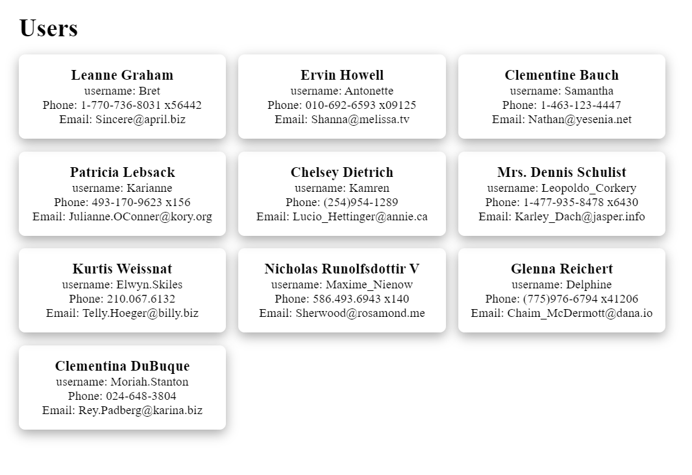
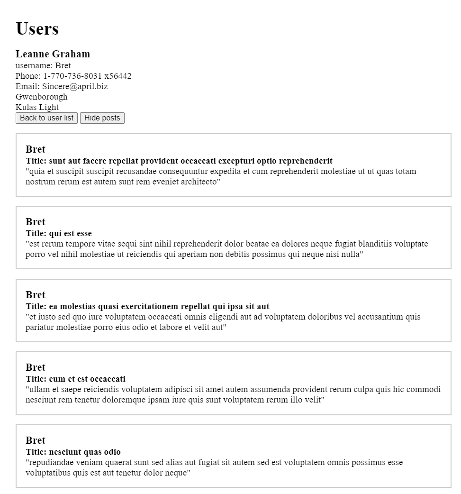

# Exercise - Intro to API

In this exercise, we were given a finished application that retrieved data from an API called [JSON Placeholder](https://jsonplaceholder.typicode.com/). The data retrieved was a list of users, and it showed detailed information about a user. To display this, the application used some classic DOM manipulation.

The task was to build on the existing codebase.

1. When we clicked on a user card, we were taken to a detail page that showed more information about the selected user. There was also a button that said "Back to user list." We created logic to return to the list of users when that button was pressed.

2. We added HTML to the `createUserPage()` method to display records _(posts)_ on the detail page belonging to the user in question. For this to work, an additional download from the API was needed, along with some DOM manipulation to hide and show the records.

3. We saved all downloads from the API in LocalStorage. This meant that once we fetched all users from the API, we would never need to fetch them again, and instead, we fetched them from LocalStorage. If we clicked on a specific user, we either used all users already saved in LocalStorage or retrieved that specific user from the API and then saved it to LocalStorage. If we pressed the same user again later, it was retrieved from LocalStorage. The records worked the same way; they were fetched from the API the first time and then saved in LocalStorage. We created logic to handle these checks automatically.

